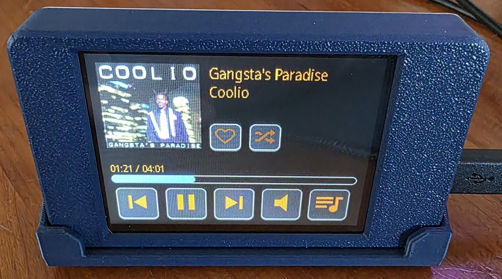

# Bragi is an ESPHome CYD device that interacts with Home Assistant and Music Assistant to control a media player's state.

----
It does not play music on its own, just controls the currently playing media.

Pronounced: "BRAH-gee"



https://youtu.be/m4RGnzpfPXs


### Requires 3 Home Assistant Helpers:
* input_text.current_album_cache_key
* input_boolean.current_track_is_favorite
* input_select.music_playlists

### Required edits:
Sorry there are so many entity ids that need to be updated, it seems that not all functionality is provided under a single entity or device.

* media_player_entity_mass: the Home Assistant media_player entity id provided by the Music Assistant integration
* entity_button_favorite: the Home Assistant entity id for the media player's favorite button
* \<media player id>: replace with the media_player entity id from Home Assistant
* \<home assistant url>: replace with your Home Assistant URL without the trailing slash, this is used to generate the resized album art

### configuration.yaml
```
shell_command:
  resize_album_art: python3 /config/python_scripts/resize_album_art.py --url "{{ url }}" --artist "{{ artist }}" --album "{{ album }}" --title "{{ title }}"
```

### Known Issues:
* Favoriting a song works but doesn't show up directly on the Music Assistant app, not sure why. Hopefully this gets fixed by their team.
  - This issue can be fixed by using AppDaemon and the python script in the app_daemon folder.
